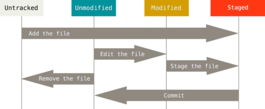

# Git

> 형상관리 / (분산)버전 관리 시스템 _ 코드의 History를 관리하는 도구

- 개발 과정 / 역사 확인 & 프로젝트 이전 버전 '복원', '비교' 가능


# GitHub

> 개발자들의 구글 드라이브 (ex. 오픈소스 프로젝트)
>
> 개발자의 이력서 & 연습장 (▶1년 동안의 게시물 → 끈기, 열정 )

## 필요 프로그램

- Git bash

  - [명령어]

    ```bash
    #비어있는 파일 만들기
    $ touch (파일명.파일형식)
    #만들어진 파일 이름 조회
    $ ls
    #현제 Working Directory(작업공간) 주소 조회
    $ pwd
    #폴더 만들기
    $ mkdir (폴더명)
    #폴더 이동
    $ cd (폴더명)
    #현재 홈 디렉토리
    $ ~
    #화면 정리
    $ clear
    `ctrl` + `l`
    
    
    ================================================
    #작업 중인 디렉토리
    $ cd
    #상위 디렉토리 이동
    $ cd..
    #하위 디렉토리 이동
    $ cd [이동할 디렉토리 이름]
    #홈디렉토리 이동
    $ cd ~
    #디렉토리 삭제
    $ rm
    #디렉토리 안 하위 디렉토리 파일까지 함께 삭제
    $ rm -r
    ```

- Typora (가장 보편적으로 사용하는 프로그램)

## 작업 흐름

> 폴더 [표시/숨기기] 탭 - 파일 확장명 & 숨김할목 Check

1. git init  → (master) 시작 시점 

   - git"파일 생성

 ```bash
 $ git init
 ```

2. 프로젝트 진행(기능 구현)

  ```bash
  $ touch github.md
  ```

3. 버전 확정

     1. add (git status 로 생겼는지 확인 가능)
            : 특정 파일을 커밋하기 위해 추가 ( Staging Area)
        
        ```bash
        #현 디렉토리 내 모든 파일/폴더
        $ git add .
        #특정 폴더
        $ git add <folder>/
        #여러 파일
        #공백으로 구분
        $ git add <file>.txt <file>.bmp
        ```
        
        
        
     2. commit (git log로 커밋 목록 확인 가능)
            : 버전 기록 (Commit)
        
        ```bash
        $ git commit -m'(커밋메세지)''
        
        #커밋 메세지 변경
        $ git commit --amend
        #가장 최근 커밋만 바꾸기
        
        #공개된 오픈소스 저장소에선 커밋 주소자체가 바뀌어서 주의
        ```

- *git log --oneline : 커밋 한줄씩만 보기*

* *git log -2--oneline : 최근 커밋 2개 보기*

* *git status : add 상황 / git log : commit 상황*

  

  3. 원격 저장소 등록 및 Push

     ```bash
     $ git remote add origin <url>
     #만들 레파지토리 주소 copy 이후 붙여넣기
     $ git push origin master
     ```
     
  3. 원격 저장소 관리
     ```bash
     #조회
     $ git remote -v
     #삭제
     $ git remote rm origin
     ```
     
  4. 원격 저장소 복제
     ```bash
     $ git clone <url>
     ```


## gitconfig

> Git 설정 파일

시스템, 글로벌, 로컬 설정을 각기 다르게 할 수 있음

*(global 설정 기본)*

프로젝트별 다른 설정 : `global` 대신 `local`

### Global

> ~/.gitconfig 파일에 기록되는 설정

```bash
#현재 설정 조회
$ git config --global -l
```

#### 필수

- User 정보

: Commit 시 Author로 기록되기 위해 초기 설정 필요

```bash
$ git config --global user.email "[자주쓰는 이메일]"
$ git config --global user.name "[]"
```

#### 선택

- Credential (*Github 인증* 등)

```bash
$ git config --global credential.provider generic
```

**git bash 2.32 발생 버그 해결*


**커밋 에디터 설정**

> 기존 vim ▶ visual studio code 로 변경

```bash
#먼저 다운로드 받고 실행해야함.
$ git config --global core.editor "code --wait"
```


## gitignore

>Git으로 추적하지 않을 / 추적되지 않을
>
>굳이 공유될 필요가 없거나 중요한 기밀 파일 등을 Commit 할 때

`.gitignore` 파일 생성 & 설정

```bash
#특정 파일
<file>.csv
<file>.xlsc
#특정 폴더
<folder>/
#특정 확장자
#와일드 카드 문자 사용 가능
*.bmp
```


- 일반적으로 `OS(운영체제 - mac, windows)` ,`특정 언어` ,`특정 개발환경`
  - https://github.com/github/gitignore/blob/master/Python.gitignore
  - https://gitignore.io


## Status

> Working Directory / Staging Area 여부 파악
>
> Untracked 데이터의 여부 파악 

- Untracked

- Tracked

  ​	Unmodified (조회 안됨_add가 안됨)

  ​	Modified

  ​	Staged




## Log

> Commit 내역 & Commit Index, Commit Message 파악

```bash
$ git log --oneline #한 줄로
$ git log -2 #최근 2개
$ git log -2 --oneline #한 줄로 최근 2개
#브랜치 조회
$ git log --oneline --graph #브랜치 그래프 형태 조회
```


## Reset 

> Commit 삭제

*#Commit History까지 삭제되니 주의*

- `--hard` : reset 하기전 SA, WD 모든 작업 리셋
- `--mixed`: (기본)SA reset _ WD작업은 남겨둠
- `--soft`: reset 하기 전까지 했던 SA, WD 작업은 남겨둠

```bash
$ git reset (--설정) <commit index>
```


## Revert

> 과거 Commit(?)을 복제해서 해당 커밋으로 덮어씌우기

*덮여진 Commit Index 유지 & 기존 Commit Index 동일*

```bash
$ git revert <commit index>
```


## Restore

> 되돌아가기

*해당 Commit으로 모두 되돌릴 수 있지만 Commit 하지 않은 내용 또한 되돌릴 수 없음*

```bash
$ git restore <file>
# Working Directory에 있는 데이터 사용
#복원 불가능
```

- Add 취소 [ Staging Area 분리]

```bash
$ git restore --staged<file>
#차이 : changes not staged of comit
$ git rm --cached <file>
```


## Branch

독립된 작업 흐름을 만들기 위해 사용

작업 완료 후, 독립 작업 흐름에 `merge`를 통해 병합

### 생성

```bash
$ git branch <브랜치 이름>
```


### 위치 이동

```bash
$ git checkout <브랜치 이름>
```


### 생성 & 이동

```bash
#동시 작업
$ git checkout -b <브랜치 이름>
```


### 목록

```bash
$ git branch
```


### 병합

```bash
# master에 위치한 상태에서 진행
$ git merge <브랜치 이름>
```


### 삭제

```bash
$ git branch -d <브랜치 이름>
```


### Scenario

#### 1. fast-foward

> master 브랜치에 변경사항이 없는 상황

```bash
$ git merge <브랜치명>
Updating [Commit index..]
Fast-forward
.
..
...

#log 해보면 단순히 HEAD를 이동했다고 나타남
```


#### 2. merge commit

> 서로 다른 Commit을 병합(merge)하는 과정에서
>
> 다른 파일이 수정되어있는 상황

> git이 auto merging을 진행하고 commit이 발생된다.

- `merge`명령 이후, 자동으로 merge commit 메시지 창

  - vim / vs code 편집기 화면 나타남

  - (자동 생성 commit message 확인)

    `esc`를 누른 후 `wq` + `Enter`  입력하여 저장 /종료

    - `w` : write
    - `q` : quit

  

#### 3. merge commit 충돌

> 병합 과정에서 동일 파일 수정된 경우

> auto merging 불가능 / 해당 파일 위치에 라벨링 해줌

```bash
#marge 과정 中
CONFLICT (content): Merge conflict in <충돌파일>

#자동 머지 실패;
Automatic merge failed; fix conflicts and then commit the result.
#(master|MERGING) 위치로 형성
```

- Status를 실행

```bash
$ git status
.
.
Changes to be committed:
        new file:   <merge 성공한 파일>
# 충돌 파일!!
Unmerged paths:
  (use "git add <file>..." to mark resolution)
        both modified:   <merge 실패한 파일>
```

- 충돌 파일 확인 및 해결(수정/편집)

- merge commit 진행

```bash
$ git commit
```

  - vim / vscode 편집기 출현
  - `esc` + ` :wq` 입력 & 탈출


## 오류

### push conflict

```bash
$ git push origin master
To <원격 저장소 주소>

# 거절됨
 ! [rejected]        master -> master (fetch first)
# error / failed
error: failed to push some refs to '<원격 저장소 주소>'

# 변경사항들(커밋..) 거절
# 원격저장소 작업이 로컬에 없다. (커밋 로그 일치 X)
hint: Updates were rejected because the remote contains work that you do
hint: not have locally. This is usually caused by another repository pushing
hint: to the same ref. 
# 너는 원할것.. 다시 push하기전에 원격저장소의 변경사항들을 먼저(first) 통합하기를..
# 예시로 git pull..
You may want to first integrate the remote changes
hint: (e.g., 'git pull ...') before pushing again.
hint: See the 'Note about fast-forwards' in 'git push --help' for details.
```

- 보통 GitHub 홈페이지 내에서 새로운 파일을 생성했을 때 발생

*README.md 를 만들라는 유혹...*


#### 해결

```bash
#해당 파일에 원격 저장소 init이 되어있다는 가정 하에
#원격저장소 내용 가져오기

$git pull origin master
```


