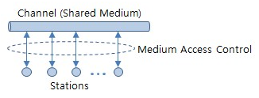

# 매체 접근 제어 : MAC 

> **Media Access Control** 의 약자 (Media가 아닌 Medium으로 풀어쓰는 경우도 있다.)
>
> "매체 엑세스 제어" 혹은  "매체 접속 제어" 라 불리우기도 한다.

OSI 모델에선 **데이터 링크 계층 ( Data Link Layer)** 의 일부이고

TCP/IP 모델에선 **링크/네트워크 엑세스 계층 (Link Layer/Network Access Layer)** 의 일부로

자료 전송 프로토콜 중 하부 계층에 위치하고 있다.

우선 이 매체 접근 제어는

**공유 매체/채널** . 

즉, LAN에서 하나의 통신 회선을 여러 단말 장치들이 원활하게 공유할 수 있도록 해주는

통신 회선에 대한 접근 방식이다.

( **공유 매체** → <u>유선</u> 이더넷 환경 & <u>무선</u> LAN 환경 : 여러 호스트/노드들이 동일 매체에 연결되어 있는 환경)

즉, 여기서 말하는 통신 회선은 

여러 단말 장치들의 **공유 매체(Shared Medium)**라고 할 수 있고

"원활한 공유할 수 있도록 해주는 것"라 함은

단말 장치간 **충돌** 발생을 **제어(경감)**하는 것이다.

출처 : 정보통신기술용어해설

MAC 방식에는 다양한 방식이 있는데

대표적으로 CSMA (반송파 감지 다중 접속) , CSMA/CD (CSMA + 충돌 탐지), 토큰 링, 토큰 버스 등이 있고

**유선 LAN** 환경에서 쓰이는 <u>*MAC방식*</u> = **CSMA/CD** , **토큰 버스(Token Bus)**, **토큰 링(Token Ring)**

**무선 LAN** 환경에서 쓰이는 <u>*MAC방식*</u> = **CSMA/CA** (반송파 감지 다중 접속 / 충돌 회피)

위와 같이 여러 방식이 구성되어 있다.

## ※ MAC 주소

쉽게 말해

데이터를 전송하기 위한 컴퓨터의 물리적인 주소라고 생각하면 된다.

실제로 컴퓨터뿐만 아니라 라우터 스위치 등 통신 장비들 모두에게 붙어있다.

즉, 네트워크와 기기/컴퓨터가 서로 통신하는데에 있어

물리적으로 연결되어 있는!!

위에서 설명했던 것 처럼 같은 **채널(Channel)** 내에 연결되어 있는

서로 이웃하거나 근접한 각 각의

물리적인 기기에 대한 판별이 가능케 하는

**하드웨어 고유 주소** 라고 생각하면 이해가 쉽다.

(주민번호 같은 의미라고 생각하면 된다.)

큰 틀에서 통신을 본다면

거리 상관없이 IP 주소를 통해 양 끝단의 통신이 이루어진다고 보여지지만

사실 자세히 들여다 보면

사이사이 거점(노드)들을 거쳐 전달이 되는데 

이 거점들 각각의 MAC 주소를 통해 서로 판별하며 통신을 한다.

이처럼 IP주소를 사용한다는 것은 결국 MAC주소를 사용한다는 것이다.

따라서 IP 주소간의 통신은 

**<u>"각 라우터 hop에서 일어나는 MAC 주소와 MAC 주소 통신의 연속적인 과정"</u>** 이라고 봐도 무방하다.

우리에게 익숙치 않은 이유는

직접 전달하지 않아도 네트워크단에서 IP주소로 MAC 주소를 알아오는 프로토콜이 있기 때문이다.

바로 그 프로토콜이 **ARP**이다...!!

IP 주소 체계의 네트워크는 계층구조로 이루어져있는데

방대한 범위에서 개인PC 범위까지 계층적으로 분류해놓은 특징을 이용해

목적 네트워크 지점까지 도착했을 때,

속해있는 네트워크 내 모든 PC에게 확성기로 "이 IP 가진 컴퓨터 손 들어!! MAC주소 좀 줘!!" 라고 물어보는거다. 

