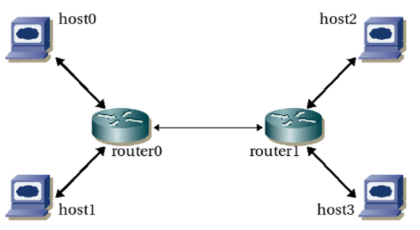

지난 글에서 네트워크 레이어에 대해 알아보았다.

통신하는 과정을 눈으로 볼 수 있지 않다보니 

단순할 줄만 알았던 네트워크 통신이 다양한 계층과 그 계층의 프로토콜에 의해

여러 단계를 거쳐 진행되고 있다는 것을 알게 되었다.

아마 주로 쓰이는 프로토콜이 TCP/IP라는 것도 지난 글을 통해 알 수 있었는데

이 두 프로토콜이 워낙 중요하다 보니 다시 한 번 이렇게 나누어 설명하게 되었다.

그럼 우선적으로 IP에 대해 최선을 다해(?) 알아보자.

---

# TCP/IP 

> ★ 이번 게시글에선 두 프로토콜 모두가 아닌 **IP**에 대해서만 다룰 예정입니다
>
> (모르는 단어가 많아 하나씩 찾아보며 공부하다 보니 적게된 양도 많아지는 바람에 나누게 되었습니다...ㅎㅎ)

컴퓨터와 컴퓨터간의 여러 연결 방식 중 지역네트워크(LAN) 와 광역네트워크(WAN)에서

원활한 통신을 가능토록 하기 위한 **통신규약**이라고 할 수 있다.

( 최초는 ARPNET(최초의 컴퓨터)를 시작으로 1980년대 초, 미국방위 통신청에서 컴퓨터간 통신을 위해 TCP/IP를 사용토록 한 것이 시초라고 하며 **UNIX**와  인터넷 사용이 늘어나면서 네트워크상에서 데이터를 전송하는 표준이 된 것이다. )

이 TCP/IP가 주로 사용되는 이유는 바로 **개방성**에 있다.

TCP/IP는 기종이 서로 다른 하드웨어, 운영체제, 접속매체 등에 관계없이 동작 가능하다는 장점이 있다.

출처 | https://12bme.tistory.com/61 

쉽게 풀어 설명해보면

 **호스트**와 **라우터**가 서로 다름에도 불구하고 관계없이 동작 가능하게끔 해준다.

그렇기에 인터넷 통신을 위한 핵심으로 선택이 되었던 것이다.

- **호스트(host)** : 최종 사용자(end-user) 응용프로그램을 수행하는 주체
- **라우터(router)** : 호스트간 데이터 송수신을 위해  여러 네트워크를 거쳐 전송 및 교환할 수 있게끔 하는 장비 

여러 용어와 구조에 대한 것은 추후에 더 자세히 다뤄보도록 하고

이번 글에서는 IP에 대해 자세히 알아보자.  

### IP (Internet Protocol)

IP는 많은 사람들이 아마 해킹이나 사이버 범죄 관련 뉴스 등에서 흔히 들어보았을 것이다.

우리의 집 주소나 전화번호처럼

네트워크 상에서 컴퓨터의 고유한 주소를 나타내는 것을 IP라고 한다.

이 IP주소는 그럼 누가 할당해줄까?

미국은 **InterNIC**에서 발급해주고 이 외의 나라들은 각 국의 **인터넷 망 관리 센터**에서 발급해준다.

(대한민국 : 한국 인터넷 진흥원) 

그렇게 현재 IP레이어는 IPv4와 IPv6가 공존하고 있다.

국내에선 일반적으로 사용하는 개인 컴퓨터의 IP 주소는 **IPv4**주소 이다.

(IPv6 네트워크 간의 통신 방법 : **터널링** / **듀얼 스택** / **헤더 변환** 등)

#### 1) IPv4

본래 IP는 **IPv4**라는 이름을 가진 주소 체계이고

**32비트 주소 체계**로 **8비트**씩 **4부분**을 나누어 각 부분을 **점(.)**으로 구분한 형태이다.

**10진 숫자**로 표현하며 각 자리는 **0부터 256까지**의 숫자를 사용할 수 있다.

이를 **IPv4**라 부른다.

IPv4 주소는 **클래스(Class)**로 분리되는데

**A** 부터 **E** 로 Class를 배정하였다.

쉽게 규모의 크기에 따라 배정했다고 생각하면 편리한데

A Class (국가/대형 통신망) , B Class (중간 규모의 통신망) , C Class(소형통신망),

그리고 D Class(멀티태스킹 용도) , E Class(실험용) 으로 분류됩니다.

하지만 전 세계에서 호스트가 증가하고 그에 주소를 할당하는 것이 어려웠기 때문에 

위 IPv4의 체계로는 감당이 되지 않았고 새롭게 개발된 체계가 **IPv6**이다.

#### 2) IPv6

이 인터넷의 효자(?) IPv6는 다행히 기존에 사용하던 IPv4와 호환이 가능하다.

 **IPv6**는 IPv4와 다르게

***NAT**를 제거함으로서

**128비트**로 확장한 주소 체계이고 **16비트**씩 **8부분**을 쪼갰으며 점이 아닌 **콜론(:)**으로 구분한다.

(ex. 2dfc:0:0:0:0217:cbff:fe8c:0)

특히 **16진수**로 표기하며 **연속되는 0 **( **미지정 주소** )은 **생략할 수 있다**는 특징이 있다. 

('0000:0000:0000' ▶ '0:0:0'  ▶ ' :: '  /  ***루프 백** 에는 ' ::1' 사용 )

이 IPv6는 지원 가능한 주소의 갯수는 무려 **43억의 네제곱**이나 된다....ㄷㄷ

**[[장점]]**

- 패킷을 단편화 하지 않으면서 기존보다 효율적인 ***라우팅**을 제공하고
- 지연에 민감한 패킷을 따로  구분해 전송 성능을 보장하는 ***QoS** 실현

- 네트워크 계층 보안 (**IPsec**) 내장
  -  Internet Protocol Security
  -  각 IP패킷을 **암호화**하고 인증하는 안전한 통신을 위한 통신규약 모음
  -  통신 세션의 개별 패킷을 인증하고 암호화하며 처리된다.

- **무상태 주소**를 자동 구성하는 기능을 제공
  - 해당 링크의 고유성을 보장된 주소를 자동으로 구성할 수 있는 기능
  - 네트워크 관리가 용이

- 헤더 구조가 개선되어 처리할  **오버헤드**(간접적인 처리시간/메모리)가 줄어들었다.

IPv6는 Class로 분리되는 IPv4와 달리

주소체계가 통신 유형에 따라 할당되는데

"**일 대 일** 통신" =   **유니캐스트(Unicast)** / **애니캐스트(Anycast)** 

"**일 대 다** 통신" =   **멀티캐스트(Multicast)**

위와 같이 할당된다.

그리고 기본적으로 ***서브넷팅**을 사용해서 

주어진 주소 공간 할당에 맞춰 네트워크 크기를 조정한다.

#### ※NAT (Network Address Translation _ 네트워크 주소 변환)

"TCP/UDP 포트 숫자와 소스" 및 "목적지의 IP 주소" 등을 **재기록**하면서

**라우터**를 통해 **네트워크 트래픽**을 주고 받는 기술이다.

이는 패킷에 변화가 생기기 때문에 

IP 나 TCP/UDP의 "<u>체크섬(checksum)</u>도 다시 계산되어 재기록"을 해야하기 때문에

호스트 간의 통신에 있어 **복잡성**을 증가시켜 네트워크 성능을 떨어뜨리는 상황이 발생한다.

- **체크섬(checksum)** : 중복 검사의 한 형태, **순환중복검사(CRC)**라 불리기도 함
  - 간단히 말해 송신된 자료의 무결성을 보호하는 방법이다.
  - TCP/IP, MAC 등의 계층에서 오류검증으로 사용한다.

#### ※ 루프백(Subnetting)

#### ※ 라우팅

#### ※ Qos

#### ※ 서브넷팅(Subnetting)

**서브넷팅** 은 *IP주소 낭비를 방지하기 위한*  원본 네트워크를 **여러 개의 네트워크로 분리**하는 과정

IP를 이렇게 쪼개는 이유는

IP 주소가 모자라기 때문이며 네트워크 구축 시에 가장 중요한 부분이라고 한다. (서버관리 시에 꼭 필요한 부분이라고 합니다...!!)

- 서브넷 마스크 ( IP Subnet Mask)

  - 간단히 말해 **부분망**이다.(0~255로 이루어져 있는 섹션)
  - 

  IP주소에는 반드시 서브넷 마스크가 있는데 이 마스크가 위 IPv4부분에서 설명했던 이다.  

 