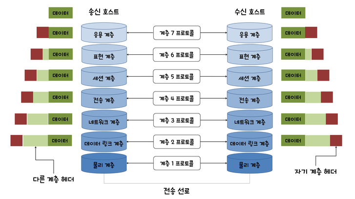
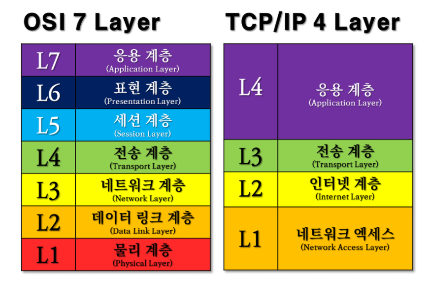

# 네트워크 레이어 (계층)

우리가 눈으로 보는 부분은 그저 인터넷에 접속해서 원하는 페이지가 화면에 나타나는 것뿐이지만

이 부분은 우리가 데이터 교환을 하며 네트워크 통신을 하는데 있어

여러 네트워크 레이어를 거치는 과정 중 가장 끝 단인 **응용계층**에서 처리 결과를 보는 것 뿐이다.

위에서 말한 여러 네트워크 계층마다 통신하는 방법이 다르기 때문에

적합한 **프로토콜**에 맞추어 원활한 통신이 이루어지게 된다.

이 네트워크 레이어와 각 레이어마다의 프로토콜은 이미 정의되어 있는데

바로 **OSI 모델 (Open Systems Interconnection Reference Model)** 이다.

## OSI 모델 ( OSI 7계층 )

네트워크 레이어를 얘기할 때 **OSI 모델 (Open Systems Interconnection Reference Model)**을 빼놓을 수 없는데

**국제 표준화 기구(ISO)**에서 개발한 네트워크 프로토콜 상호 통신을 위한 표준화된 계층(절차)으로 나타낸 모형이다.

총 **7개**의 층으로 분류하고 각 계층의 기능에 적합한 표준화된 서비스와 프로토콜을 규정한다.

이 프로토콜을 통해 상호간의 접속, 전달 방식, 통신 방식, 교환 데이터 형식, 오류검출 방식, 코드 변환 방식, 전송 속도 등에 대해 이미 약속이 되어 있다.

(각 계층의 프로토콜과 그에 대한 설명은 다음 게시물에 작성하려 한다.)

이렇게 통신을 단계별로 표준화를 함으로서 통신을 방해하는 기술적인 문제를 제거하고

정보 교환을 위한 접속점을 정의해서 시스템간 통신이 용이하게 만들어준다,

| 단계  | 계층    | 역할 |
| ----- | ------- | ---- |
| 1계층 | 물리 (Pysical) | 전송방식, 부호화 방식, 케이블 형태, 충돌 감지 방식, 신호 형식 등을 정의 (H/W적) |
| 2계층 | 데이터 링크(Data Link) | 동기화, 오류제어, 흐름제어, 오류 검출 및 복구 등의 기능 |
| 3계층 | 네트워크 (Network) | 시스템 간 데이터 교환 기능으로 패킷관리, **경로 배정(Routing)** 등을 수행 |
| 4계층 | 전송 (Transport) | 투명하고 신뢰성 있는 데이터 전송을 제공 (상하위 계층 간 중간 인터페이스 역할) |
| 5계층 | 세션 (Session) | 송수신 양 끝단의 응용프로세스 통신을 관리하기 위한 방법을 제공  ( 동시 송수신 방식[duplex], 반이중 방식[half-duplex], 전이중 방식[Full Duplex]의 통신 모드 결정) |
| 6계층 | 표현 (Presentation) | 데이터 재구성, 사용자 명령어를 완성하고 결과 표현하는 등의 기능 |
| 7계층 | 응용 (Application) | 네트워크 소프웨어 UI , 사용자 입출력(I/O) 부분의 통신 |

 출처 : 

[오늘도 MadPlay]: https://madplay.github.io/post/network-osi-7-layer	"OSI 7계층 (OSI 7 Layer)"

하지만 이 **OSI 모델**은 개념적으로 사용되는 모델이지 실질적으로 사용되지 않는 모델이다.

그렇다고 아예 안쓰는 것이 아니라

***SSL***이나 ***TLS*** 프로토콜을 설명할 때 적합하다고 한다.

( OSI모델 내 **세션**계층에서 쓰이는 프로토콜 )

실질적으로 인터넷을 포함한 "모든 네트워크에 사용되는 표준 프로토콜 모델"은 **TCP/IP** 모델이다. 

바로 **TCP/IP 모델**에 대해 알아보자

## TCP/IP 모델

자, 그럼 이전에도 언급했던 **TCP/IP 모델**은 무엇일까?

앞서 설명했듯

실질적으로 대부분의 경우,

TCP를 기반으로 많은 수의 애플리케이션 프로토콜들이  IP 위에서 동작하기 때문에  

**TCP**(4계층 Protocol)과 **IP**(5계층 Protocol) 기반으로 이루졌고 이를 묶어서 부르기 위해**TCP/IP**라 부르게 되었고 

이에 대해 정형화된 모델로 **TCP/IP모델**이 개발되었고

그렇게 **TCP/IP**라는 용어가 **인터넷 프로토콜**을 대표하는 용어가 됐다.

우리는 이 부분에서 표현은 한 덩어리로 하지만 각자 다른 별개 계층의 프로토콜이라는 것을 기억하고 있어야 한다.

이 TCP/IP 모델의 기반으로 컴퓨터를 연결하는 체계를 **이더넷(Ethernet)**이라고 부른다.

어쨋든 이 TCP/IP는 정형화된 모델로서 개발되었는데

그것이 바로 **TCP/IP 모델**이다.

**OSI모델**과의 가장 큰 차이점은 **계층 수**인데

**TCP/IP모델**은 **4계층**으로 이루어져있다. 

(사실, 2계층을 **ARP** 를 기준으로 다시 나눠 총 5계층이라 하기도 한다.)

이 TCP/IP 모델을 설명할 때 OSI모델과 비교하면 훨씬 이해하기 쉽다.

동일한 모델은 아니지만 이해하기 쉽게 설명하자면

- **1계층 _ 네트워크 엑세스/인터페이스 계층 (Network Access/Interface Layer)**
  - *(OSI 7계층 中)* <u>물리</u> 계층 [1계층] + <u>데이터 링크</u> 계층 [2계층] 
  - 물리적인 주소로 MAC을 사용하고 **LAN**, **패킷망** 등에 사용된다.

- **2계층 _ 인터넷 계층 (Internet Layer)**
  - *(OSI 7계층 中) <u>네트워크</u> 계층 [3계층]
  - 통신 노드간의 IP 패킷을 전송하는 기능과 라우팅 기능을 수행한다.
  - 프로토콜 : **IP**, **ARP**, **RARP**
    - 이 ARP, RARP 프로토콜 사용 계층을 추가적으로 별도 계층으로서 나누기도 한다. 

- **3계층 _ 전송 계층 (Transport Layer)**
  - *(OSI 7계층 中)* <u>전송</u> 계층 [4계층]
  - 통신 노드간의 연결을 제어하고 신뢰성있는 데이터 전송을 담당한다.
  - 프로토콜 :  **TCP**, **UDP**

- **4계층 _ 응용계층 (Application Layer)**

  - *(OSI 7계층 中)*  <u>세션</u> 계층 [5계층] + <u>표현</u> 계층 [6계층] + <u>응용</u> 계층 [7계층]
  - **TCP/UDP** 기반의 응용 프로그램을 구현할 때 사용한다.
  - 프로토콜 : **FTP**, **HTTP**, **SSH**

  

출처 : 넌 잘하고 있어 https://hahahoho5915.tistory.com/15