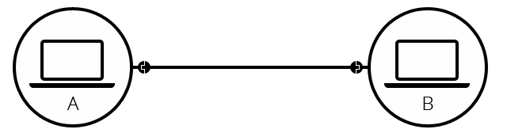
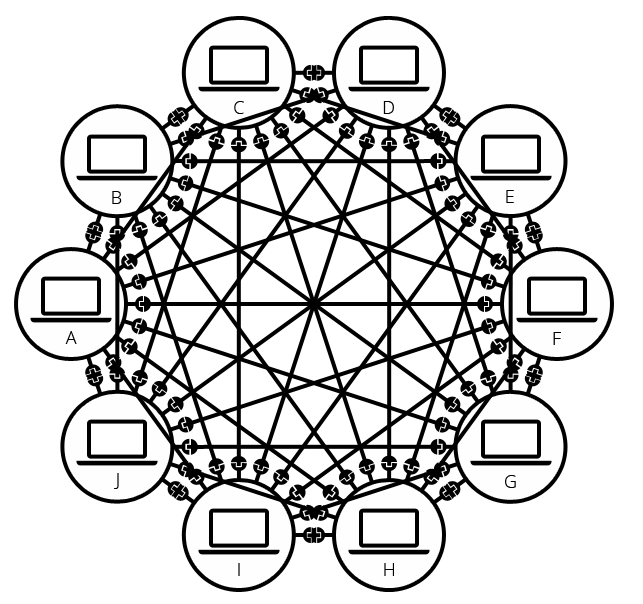
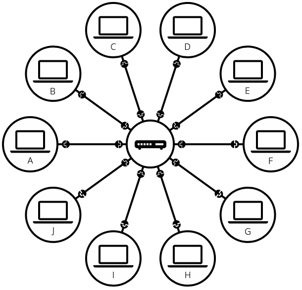
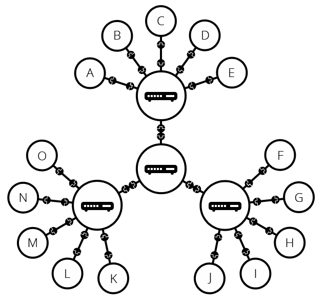
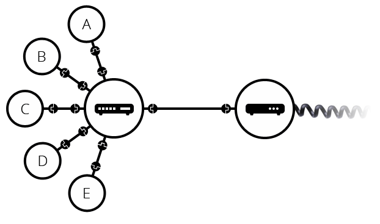

#  인터넷의 동작 원리

> TCP/IP 모델의 **네트워크 인터페이스 계층**에서부터 시작할 예정이다.
>
> (위 모델의 1계층은 OSI 모델의 최하위 1, 2계층이 결합된 느낌이지만 
>
> 이 중 1계층인 물리적 계층 기기들과 그에 대한 프로토콜을 제외하다.)

지금까지 네트워크 계층과 그에 대한 프로토콜을 알아보았다.

현재 대부분 사용하고 있는 

서로 다른 컴퓨터, 시스템간의 통신에 사용되는 프로토콜은 **개방성**이 뛰어난  **TCP/IP**인 것과

이 통신기기들을  *(OSI 모델 내)* 가장 하위계층인 [1계층_**물리적 (H/W) 계층**]으로 통신이 연결되어 있는 것을 알 수 있었다.

여기서 우리가 주로 이용하는 **TCP/IP 모델** 내에서 또한 1계층이지만

기기 들이	

이 부분은 우리도 컴퓨터를 보면 알 수 있는데

흔히 알고 있는 <u>**네트워크 허브**</u>, <u>**네트워크 어댑터**</u>, <u>**중계기**(*리피터*) 및 **케이블**</u> 등을 통해 연결한 것이 서로 다른 기기간 통신에 있어 하드웨어적으로 연결되어 있는 것이 물리적 네트워크 계층에서의 통신을 연결해주고 있다고 보면 된다 .

( 이 기기들을 보통 '*<u>하드웨어 장비</u>* '  혹은 '<u>네트워크 노드</u>' 라고 부른다.)

어쨋든 이번 시간엔 인터넷의 구동과 관련해서 소개할 예정이기에

설명에 사용할 모델을 "인터넷 통신 계층의 프로토콜 (**TCP/IP 프로토콜 스위트**)"을 기준으로 설명하도록 하겠다.

그렇다면 인터넷의 동작 원리에 대해 알아보도록 하자!!

---

우선 단순하게 우리의 시선에서 네트워크가 무엇이냐 라고 한다면

 *" 두 개의 컴퓨터가 통신이 필요할 때, 다른 컴퓨터와 물리적/무선으로 지속적인 연결이 되는 것 "* 이라고 생각할 수 있다.

 (물리적 : 보통 **이더넷**, 무선 : **Wi-Fi**, **Bluetooth** 등)

 
 출처 : MDN Web Docs (https://developer.mozilla.org/ko/docs/Learn/Common_questions/How_does_the_Internet_work) 

물론 이런 네트워크는 두 대의 기기로 제한되는 것이 아닌

제한없이 원하는 만큼의 컴퓨터를 연결할 수 있다.

하지만 위 그림같이 모든 컴퓨터끼리 연결되게 된다면 어떻게 될까.

 
 출처 : MDN Web Docs (https://developer.mozilla.org/ko/docs/Learn/Common_questions/How_does_the_Internet_work) 

겨우 10개의 컴퓨터가 연결되어 있을 뿐인데 이렇게나 복잡하게 연결되어 있고

무려 기기당 9개의 플러그와 더불어 45개의 케이블이 필요한 모습이다.

실제로 통신의 효율 또한 상당히 떨어지는 참사가 일어날 것이다.

위와 같은 문제를 해결하기 위해 존재하는 기기가 있다.

바로 "**라우터 (Router)**" 이다.

라우터는 각 기기들을 위한 <u>전화국</u>과 같은 특수한 소형 컴퓨터이다.

각 기기들간의 통신에서 올바른 송수신이 이루어지게 해준다.

 출처 : MDN Web Docs (https://developer.mozilla.org/ko/docs/Learn/Common_questions/How_does_the_Internet_work) 

순차적으로 원활한 통신이 되는 것을 보니 마음이 편안해진다.

하지만 아직 문제점이 완전히 해결되지 않았다.

만약 앞서 봤던 것처럼 10대의 컴퓨터가 아니라 수천, 수억 대의 컴퓨터라면?

벌써부터 골치가 아프지만 다행히 해결방법은 늘 존재한다.

바로 **라우터끼리 연결**하는 것이다.

이와 같은 방법으로 우리는 무한히 확장할 수 있을 것이다. 

 출처 : MDN Web Docs (https://developer.mozilla.org/ko/docs/Learn/Common_questions/How_does_the_Internet_work) 

하지만 안타깝게도 아직 문제가 더 남아있다.

현대사회에서는 국경과 시간의 한계없이 인터넷을 통해 세계 어느 곳에서든 자유로운 통신을 하고 있다.

하지만 위와 같이 아무리 라우터끼리 연결한다면

케이블을 서로 직접적으로 연결할 수 없어 불가능했을 것이다.

그렇다면 어떻게 해결했을까?

이 해결방법 또한 

우리가 흔히 볼 수 있고 심지어 알고 있는 방법이다. 

그것은 바로

이미 세계적으로 서로 연결되어 있는 전화기 기반 시설에 있다.

우리가 가정 내에서 흔하게 볼 수 있는 전력/전화 케이블을 통해 연결하는 것이다.

우리의 네트워크를 **전화망 (통신망)**과 연결하여 지금과 같은 통신이 가능하다는 것 (**전화접속**)이다.

(전화 접속으로 쓰이는 통신 프로토콜도 다양하고 해당 서비스를 이용하는데에 있어 요금제 또한 알아보면 재밌지만 조금 벗어나는 내용인 것 같아 다음에 설명하도록 하겠다.)

 출처 : MDN Web Docs (https://developer.mozilla.org/ko/docs/Learn/Common_questions/How_does_the_Internet_work) 

하지만 라우터에서 전화망으로 연결할 때, 

받아서 운용해줄 수 있도록 **변/복조** 해줄 장치가 필요하다.

이 변복조 장치를 **모뎀(MODEM_MOdulator and DEModulator)**라고 한다.

통화국과 우리 <u>라우터 (공유기)</u> 의 네트워크 신호를 서로 송수신 받을 수 있도록 하는 장치라고 생각하면 된다.

(실제 라우터는 네트워크 범위가 큰 경우에 적합하고 고가이기 때문에 개인 가정의 경우 공유기로 기능을 대체한다고 보면 된다.)

우리에게 매우 익숙한 장치이다.

힌트는 우리의 **이더넷 케이블**에 있는데

 출처 : 위키백과 (https://ko.wikipedia.org/wiki/%EC%9D%B4%EB%8D%94%EB%84%B7) 

이 케이블을 어디와 어디를 연결했는지 기억하는가?

공유기처럼 생긴 기계와 연결했던 것도 같고

벽 면에 꽂았던 기억도 있을 것이다.

그렇다.

그것이 모뎀이다.

이전에는 공유기와 일체형이였고

현재는 대부분 **벽 면**에 설치되어 있다. 

어쨋든 이렇게 모뎀을 통해 신호를 변환하여 전달하고

그렇게 전달된 신호는 **ISP**로 전달되어 대상 네트워크로 연결됨으로서

**인터넷 연결 구조**가 완성된다.

(여기서 ISP로의 신호 전달 매체는 유선과 무선이 있다.

우리나라에서 유명한 광섬유를 이용한 **광케이블** 등이 하나의 예이다.

해저에 뭍혀있거나 땅 속에 뭍혀있는 것이 바로 ISP로 연결해주는 선인 것이다.)

대한민국의 경우 **통신망 보유 회사**가 <u>인터넷 서비스도 제공</u>하고 있기 때문에

따로 구분해서 생각하기가 어렵다.

사실 개인의 네트워크 메세지를 받아 전용 네트워크를 통해 대상 네트워크로 전달해주는 업체를

**인터넷 서비스 제공업체(ISP_Internet Service Provider )**라고 하는데

방금 말했듯이 대한민국의 경우 통신망 보유 회사가 서비스도 제공하기 때문에

쉽게 말해 **올인원**의 형태로 

ISP가 라우터와의 통신부터 네트워크 연결 중개까지 해주는 것이다. 

이름이 생소할 뿐이지 우리에게 익숙한 <u>*KT , SK텔레콤 , SK브로드밴드 , LG U+*</u> 등의 기업이 ISP 이다.

---

여기서 잠깐!!

그럼 얘네들은 서로 어떻게 신호를 주고 받을까?

이 부분에서 알아야하는 것이 바로 **IP (인터넷 프로토콜)**이다.

통신 기기에서 메시지를 보내려면 받을 **특정 기기**를 **지정**해야한다.

그렇기에 각자 고유한 **IP주소**가 할당되는 것이다.

이 IP주소는 이전에 알아보았듯이 **점(.)**으로 구분되어 있는 숫자들의 집합이다.

사람이 당연히 읽기 불편할텐데

이를 읽기 쉽도록 **고유한 IP주소**에 **이름**을 부여한 것이 **도메인 이름 (Domain Name)**이다.

(ex. **Google**_https://www.google.com 의 본래 주소는 **173.194.121.32** 이다)

다음엔 이 **도메인 이름**에 대해

그리고 이번에 알아본 **인터넷**이라는 연결 인프라를 기반으로 구축되어 제공되는 서비스, **웹(Web)**에 대해서 알아보자.

