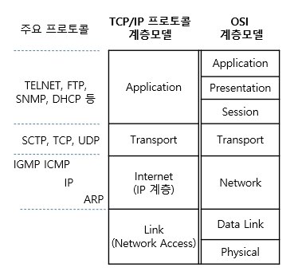
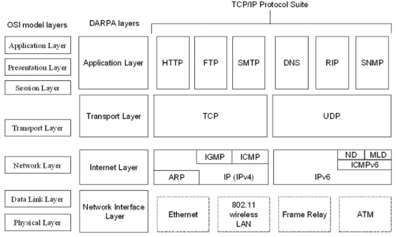
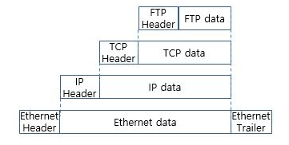
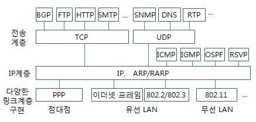

# 인터넷 프로토콜 스위트(Internet Protocol Suite)

> TCP/IP가 주로 쓰이기 때문에 **TCP/IP Protocol Suite** 라고 부르기도 한다.

이번 글에서는

**인터넷 프로토콜 스위트** [**TCP/IP 프로토콜 스위트**] 에 대해 알아보려 한다

이전 게시글을 통해 **OSI 모델** 각 계층 프로토콜에 대해 먼저 알아보았다. 

두 모델은 유사하게 **계층형**구조이지만

총 계층의 수도 다를 뿐더러 같은 이름의 계층이라도 소속되어있는 프로코톨도 상이하다. 

사실 역사적으로는 

OSI 모델 보다  인터넷 프로토콜 스위트가 먼저 개발되었고

실제로 실질적인 통신 자체에서는 인터넷 프로토콜이 사용되지만

말 그대로 실질적인 통신을 계층으로 나눈 <u>"비표준 모델"</u>이기 때문에

4계층으로 나누는 경우도 있고, 5계층으로 나누는 경우도 있으며

각 계층을 부르는 이름도 다르게 하는 경우도 있어 

혼란을 야기할 것 같았다

그에 반해, OSI 모델은

**국제 표준화 기구(ISO)**에서 개발한 국제 표준 모델이기도 하고

인터넷에만 국한되어있지 않은

전반적인 통신 기술 **자체**의 표준이 세세한 분류되어 있어

통신에 대해 먼저 이해할 때 도움이 될 것 같아 먼저 알아봤다.

자!

이번엔 현대 인터넷에서의 데이터 통신에서 쓰이는

실질적인 통신 모델 **인터넷 프로토콜 스위트**의 

**각 계층별 프로토콜**을 알아봅시다.

---

출처 : 정보통신기술용어해설

출처 : https://heeestorys.tistory.com/612

### L1 . 네트워크 엑세스 계층 (Network Access Layer)

> **링크 계층** (Link Layer) 라고 부르기도 하며 
>
> *네트워크 인터페이스 계층* 이라고도 불리는 경우가 있다.
>
> (5 계층으로 나누는 경우는  물리 계층과 데이터 링크 계층을 분리했을 경우이다.)

OSI 7계층과 비교하자면

***물리 계층(1계층_Physical)*** 과 ***데이터링크 계층(2계층_Data Link)***에 해당한다.

( 하지만 이는 **운용범위**를 고려했을 때의 설명이지 운용 절차, 데이터 시맨틱, 네트워크 기술의 세부 규정까지 동일하다 취급할 수 없다.)

해당 계층에는 호스트(Host)가 물리적으로 연결되는 링크 상에서만 운용되는 메소드(Method), 통신 프로토콜이 모여있다.

여기서 **링크**는

네트워크 상의 <u>*호스트나 노드(Node)를 상호 연결*</u>하기 위해 사용되는

**물리, 논리 네트워크 구성 요소**를 나타내고

이에 대한 **링크 프로토콜(Link Protocol)**은

<u>*"근거리 통신망 세그먼트(LAN Segment)"*</u> 나 *"광역 통신망(WAN) 연결의 <u>인접 노드"</u>* 간에만 운용되는 

메서드와 표준의 스위트이다.

**① 이더넷 (Ethernet)**

- 이더넷은 OSI 모델 중 데이터 링크 계층에서 설명했다
- *「인터넷 구동 원리」 참고.*

**② 토큰링 **

**③ FDDI**

**④ **

**⑤ PPP**

**⑥ SLIP (Serial Line Internet Protocol)**

-  *「직렬 회선 인터넷 프로토콜 」*  혹은  *「시리얼 라인 인터넷 프로토콜 」* 

- 컴퓨터에 내장된 *<u>직렬 포트</u>* 에서 인터넷 등의 <u>*TCP/IP 네트워크*</u> 에 

  전화선 등과 같은 직렬 통신 회선의 <u>지속 회선을 통해 **일시적으로 접속**하기 위해</u> 사용된 프로토콜

- *대부분 **PPP**로 대체된 상태*

**⑦ Wi-Fi **

**⑧ ATM (Asynchronous Transfer Mode_비동기 전달 모드)**

- 

**⑨ 프레임 릴레이**

- OSI 모델에서 X.25 프로토콜의 근간이 되었던 기술이라고 설명했었는데 이번 글에서 설명해보려한다.
- ***하단 별도 설명 참고***

### L2 . 인터넷 계층 (Internet Layer)

> 세부적으로 나눌 경우
>
> 해당 계층에서도 **2.5 단계** 로 **ARP** & **3단계**를 **인터넷 계층**으로 세분화하는 경우가 있다.
>
> (위 모델 구조 그림처럼 인터넷계층에서만 프로토콜들의 순서가 구분하여 보여주는 이유)

OSI 7계층과 비교하자면

***네트워크 계층(3계층_Network)*** 에 해당한다.

#### ★ ARP (Address Resolution Protocol) / RARP (Reverse ARP)

- **ARP** : 주소 결정 프로토콜
- **RARP** : 역순 주소 결정 프로토콜

① **IP (Internet Protocol)**

- **IP**. 즉 인터넷 프로토콜은 스위트 설명할 때 모두 풀어내기엔 방대한 양이기에

  IP가 "인터넷 프로토콜 스위트에서 TCP와 함께 가장 많이 쓰이는 프로토콜" 이며

  "두 번째 계층인 인터넷 계층을 차지하고 있다"라고 정리하고 넘어가자

  - *(이 후, 별도로 IP에 대해 공부해보도록 하자.)*

### L3 . 전송 계층 (Transport Layer)

OSI 7계층과 비교하자면

동일한 이름의 ***전송 계층(4계층_Transport)*** 에 해당한다.

### L4 . 애플리케이션/응용 계층 (Application Layer)

OSI 7계층과 비교하자면

동일한 이름의 ***응용 계층 (7계층_Application)*** 과 더불어

***세션 계층 (5계층_Session)*** + ***표현 계층 (6계층_Presentation)***  3가지 계층에 종합적으로 해당한다.

OSI 모델에서의 응용계층과 목적이 유사하다.

최종 사용자.

즉, 컴퓨터(기기)를 사용하고 있는 우리와 가장 근접하고

사용자 응용 프로그램으로부터 요청을 받아 이를 적절한 메시지로 변환 후, 하위 계층으로 전달하는 역할을 맡고 있다.

- HTTP
- SMTP
- FTP
- TELNET
- SNMP
- DNS

출처 | 정보통신기술용어해설 : 계층간 데이터 포맷

출처 | 정보통신기술용어해설 : 주요 프로토콜 관계도

## ※ 프레임 릴레이 (Frame Relay)

>  **프레임 (Frame)** : *가변 길이 단위*

**LAN** / **WAN (광역통신망)** 내 단말 지점의 <u>비용&효율적인 데이터 전송</u>을 위해 고안된 방법이다.

"프레임에 데이터를 넣고" 재전송과 같은 필요한 <u>오류 정정 기능은</u> <u>"**단말 지점**"에 맡기면서</u>

**전체 데이터 전송 속도**를 향상시킨다.

( 패킷을 전송하는 방법과 차이가 있다. _ **X.25**)

|                           | X.25                                          | Frame Relay                                                  |
| ------------------------- | --------------------------------------------- | ------------------------------------------------------------ |
| **목적**                  | 높은 에러율의 링크상에서  오류 없는 전송 | 낮은 에러율을 가진 링크 사용  (X.25의 서비스 상당부분 제거) |
| OSI 모델 내 **처리 계층** | 1, 2, 3 계층                                  | 1, 2 계층                                                    |
| **전송**                  | 패킷(Packet)                                  | 프레임(Frame)                                                |
| 상대적 **속도**           | 느림                                          | 20배 이상 빠름                                               |
| 사용 대역폭               | 고정된 대역폭                                 | 채널간 설정 협상을 통해  동적으로 대역폭 할당           |
| 특징                      | - 오류 제어 및 흐름제어를 위한 필드가 포함됨  | - 제어를 위한 필드 없음 - 확장 **주소 필드** 포함 (목적지까지 최소한의 프로세싱 & 프레임 직접 전송) |
