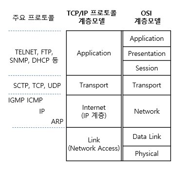
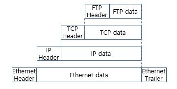
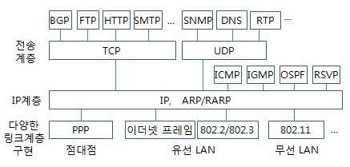

# 인터넷 프로토콜 스위트(Internet Protocol Suite)

> TCP/IP가 주로 쓰이기 때문에 **TCP/IP Protocol Suite** 라고 부르기도 한다.

이번 글에서는

**인터넷 프로토콜 스위트** [**TCP/IP 프로토콜 스위트**] 에 대해 알아보려 한다

이전 게시글을 통해 **OSI 모델** 각 계층 프로토콜에 대해 먼저 알아보았다. 

두 모델은 유사하게 **계층형**구조이지만

총 계층의 수도 다를 뿐더러 같은 이름의 계층이라도 소속되어있는 프로코톨도 상이하다. 

사실 역사적으로는 

OSI 모델 보다  인터넷 프로토콜 스위트가 먼저 개발되었고

실제로 실질적인 통신 자체에서는 인터넷 프로토콜이 사용되지만

말 그대로 실질적인 통신을 계층으로 나눈 <u>"비표준 모델"</u>이기 때문에

4계층으로 나누는 경우도 있고, 5계층으로 나누는 경우도 있으며

각 계층을 부르는 이름도 다르게 하는 경우도 있어 

혼란을 야기할 것 같았다

그에 반해, OSI 모델은

**국제 표준화 기구(ISO)**에서 개발한 국제 표준 모델이기도 하고

인터넷에만 국한되어있지 않은

전반적인 통신 기술 **자체**의 표준이 세세한 분류되어 있어

통신에 대해 먼저 이해할 때 도움이 될 것 같아 먼저 알아봤다.

자!

이번엔 현대 인터넷에서의 데이터 통신에서 쓰이는

실질적인 통신 모델 **인터넷 프로토콜 스위트**의 

**각 계층별 프로토콜**을 알아봅시다.

---

출처 : 정보통신기술용어해설

### L1 . 네트워크 엑세스 계층 (Network Access Layer)

> **링크 계층** (Link Layer) 라고 부르기도 하며 
>
> *네트워크 인터페이스 계층* 이라고도 불리는 경우가 있다.

OSI 7계층과 비교하자면

***물리 계층(1계층_Physical)*** 과 ***데이터링크 계층(2계층_Data Link)***에 해당한다.

### L2 . 인터넷 계층 (Internet Layer)

> 세부적으로 나눌 경우
>
> **2.5 단계** 로 **ARP** & **3단계**를 **인터넷 계층**으로 나누는 경우가 있다.
>
> (위 모델 구조 그림처럼 인터넷계층에서만 프로토콜들의 순서가 구분하여 보여주는 이유)

OSI 7계층과 비교하자면

***네트워크 계층(3계층_Network)*** 에 해당한다.

#### ★ ARP (Address Resolution Protocol) / RARP (Reverse ARP)

- **ARP** : 주소 결정 프로토콜
- **RARP** : 역순 주소 결정 프로토콜

### L3 . 전송 계층 (Transport Layer)

OSI 7계층과 비교하자면

동일한 이름의 ***전송 계층(4계층_Transport)*** 에 해당한다.

### L4 . 애플리케이션/응용 계층 (Application Layer)

OSI 7계층과 비교하자면

동일한 이름의 ***응용 계층 (7계층_Application)*** 과 더불어

***세션 계층 (5계층_Session)*** + ***표현 계층 (6계층_Presentation)***  3가지 계층에 종합적으로 해당한다.

출처 | 정보통신기술용어해설 : 계층간 데이터 포맷

출처 | 정보통신기술용어해설 : 주요 프로토콜 관계도

