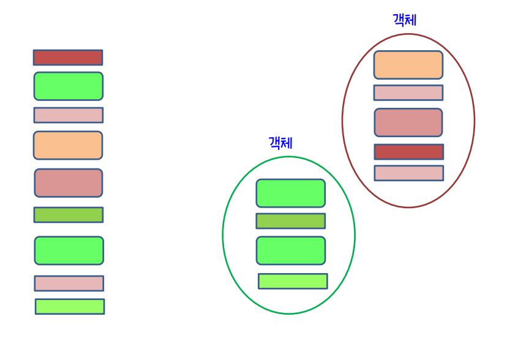
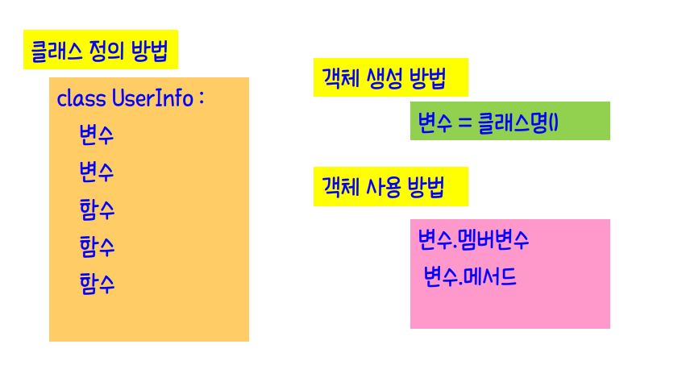
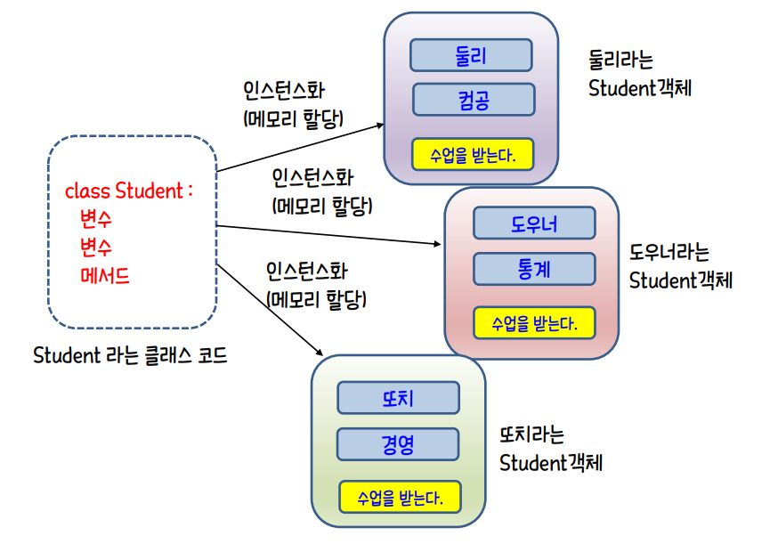
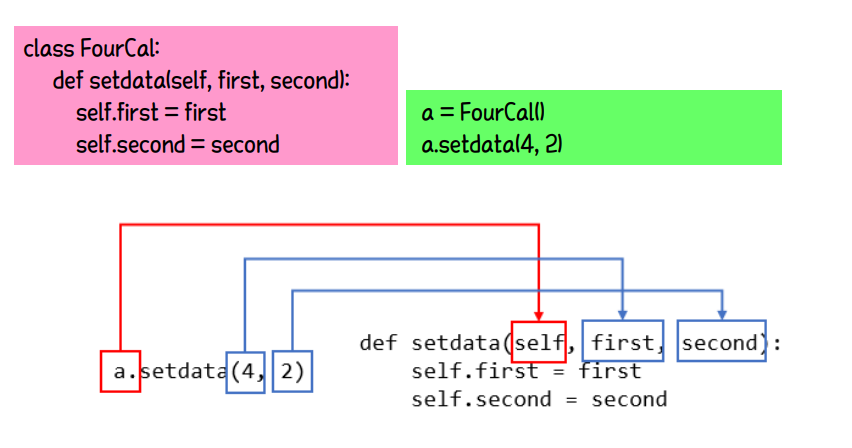
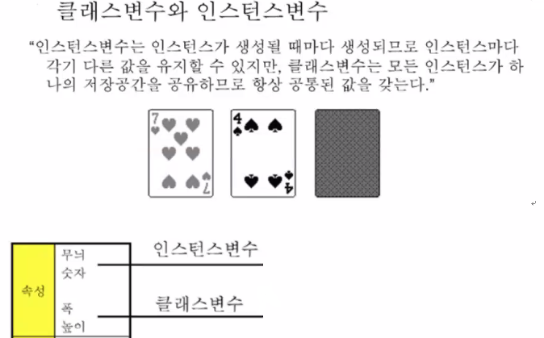
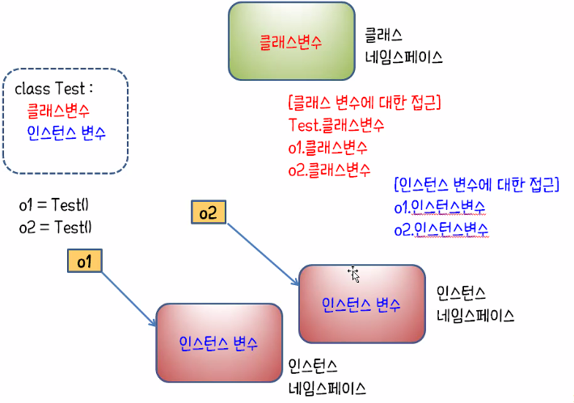

# 클래스 (Class)

> 관련된 속성과 동작을 하나의 범주로 묶은 형태

※ **객체 지향 프로그래밍** = **OOP** (Object Oriented Programming)

- **모델링(Modeling)** : 사물을 분석하여 *<u>필요한 속성과 동작을 추출</u>*하는 것
- **캡슐화(Encapsulation)** : "모델링한 결과"를 *<u>클래스로 포장</u>*하는 것




```python
def deposit(name, money):
	if name == "둘리" :
 		global balancedooly
 		balancedooly += money
 	elif name == "또치" :
 		global balanceddochi
 		balanceddochi += money
 	elif name == "도우너" :
 		global balancedouner
 		balancedouner += money

def inquire(name):
 	if name == "둘리":
 		print("%s의 잔액은 %s원입니다." % (name, format(balancedooly, ',')))
 	elif name == "또치":
 		print("%s의 잔액은 %s원입니다." % (name, format(balanceddochi, ',')))
 	elif name == "도우너":
 		print("%s의 잔액은 %s원입니다." % (name, format(balancedouner, ',')))

dooly = "둘리"
ddochi = "또치"
douner = "도우너"

balancedooly = 8000
balanceddochi = 8000
balancedouner = 8000
```


위와 같이 매번 데이터가 추가될 때마다 추가를 하게되면 무거운 프로그램이 됨

**▼class**를 통해 간략하게 **캡슐화**▼

```python
class Account:
def __init__(self, name, balance):
 	self.name = name
 	self.balance = balance
 
def deposit(self, money):
 	self.balance += money

def inquire(self):
 	print("%s의 잔액은 %s원입니다." % (self.name, format(self.balance, ',')))

    
obj1 = Account("둘리", 8000)
obj2 = Account("또치", 8000)
obj3 = Account("도우너", 8000)
```



- **멤버(Member)** : 클래스를 구성하는 **변수**와 **함수**
- **메서드(Method)** : 클래스에 **소속된 함수**

- **인스턴스(Instance)** : 해당 클래스의 **구조**
  - 특정객체가 어떤 클래스의 객체인지 *"<u>관계</u>"*를 나타낼 때 사용





## 생성자

> 클래스 선언

- **`__init__`** 생성자
  - 객체 초기화하는 기능
  - **객체**를 첫 번째 인수 **self** 로 전달
  - 생성문에서 전달한 인수를 두 번째 이후의 인수로 전달
- `객체 = 클래스명(인수)` 로 **대입** 
- `객체.메서드()`로 **메서드 호출**
- **메서드(Method)**는 필요한 만큼 선언 가능



```python
class 이름 :
    def __init__(self, 초기값) :
        #멤버(Member) 초기화
    ...
    <메서드 정의>
    
    
class Student :
   def __init__(self):
       print("인스턴스 생성")

   def __del__(self):		#"__del__" 파괴자
       print("인스턴스 삭제")

        
st1 = Student()	# 객체 멤버에 대입
인스턴스 생성!!
print(type(st1), st1)
<class '__main__.Student'> <__main__.Student object at 0x000001C4F5E77580>
# class 타입으로 한 메모리 구역에 할당되어 student 클래스의 인스턴스


st2 = Student()
인스턴스 생성!!
print(type(st2), st2)
<class '__main__.Student'> <__main__.Student object at 0x000001C4F5E68400>


st3 = Student()
인스턴스 생성!!
print(type(st3), st3)
<class '__main__.Student'> <__main__.Student object at 0x000001C4F5E77B50>

```


- **init** 으로 객체 초기화


```python
class Student :
   def __init__(self, name, age, subject):
       self.name = name
       self.age = age
       self.subject = subject

   def printStudentInfo(self):	#객체에서 메서드 호출시 "인수없음" 
       print("{}의 나이는 {}세입니다.".format(self.name, self.age))

   def study(self):
       print("{} 학생은 {} 과목을 학습합니다.".format(self.name, self.subject))
        
        
st1 = Student("둘리", 10, "파이썬")	#init으로 인수 대입
st2 = Student("도우너", 12, "자바")
st3 = Student("또치", 10, "자바스크립트")


st1.printStudentInfo()
st2.printStudentInfo()
st3.printStudentInfo()
둘리의 나이는 10세입니다.
도우너의 나이는 12세입니다.
또치의 나이는 10세입니다.


st1.study()
st2.study()
st3.study()
둘리 학생은 파이썬 과목을 학습합니다.
도우너 학생은 자바 과목을 학습합니다.
또치 학생은 자바스크립트 과목을 학습합니다.
```


- 메서드 선언 방식은 기존 **함수 선언** 방식과 **동일**
  - 단, 객체 호출 및 메서드 호출 방식 주의

```python
class Account:
    def __init__(self, name, balance):
        self.name = name
        self.balance = balance

    def deposit(self, money):
        self.balance += money	#호출 객체의 값에 대한 계산만 하는 메서드
    
    def inquire(self):
        print("%s의 잔액은 %s원입니다." % (self.name, format(self.balance, ',')))
        
obj1 = Account("둘리", 8000)
obj2 = Account("또치", 8000)
obj3 = Account("도우너", 8000)
obj1.deposit(1000)
obj2.deposit(2000)
obj3.deposit(3000)
obj1.inquire()
obj2.inquire()
obj3.inquire()

둘리의 잔액은 9,000원입니다.
또치의 잔액은 10,000원입니다.
도우너의 잔액은 11,000원입니다.

#클래스를 통해 호출
Account.inquire(obj1)
둘리의 잔액은 9,000원입니다.

```


## 상속

> **기존 클래스**를 확장하여 '멤버(Member)'를 **추가**하거나 **동작 변경**

- 클래스 이름 다음 괄호 안에 *<u>"부모 클래스" 이름 지정</u>*
- **"super( )."** : **메서드 오버라이딩** _ 자식 클래스에서 부모 메서드 불러오는 명령
- 자식 클래스는 부모 클래스의 모든 메서드를 물려받음
- 자식 클래스의 *<u>개수</u>* 에는 **제한 없음**
- 자식클래스에서 *<u>또 다른 클래스</u>* **파생**도 가능하다.

```python
class Human:
    def __init__(self, age, name):
        self.age = age
        self.name = name

    def intro(self):
        print(str(self.age) + "살 " + self.name + "입니다")

    def eat(self):
        print("밥을 먹는다")

#자식 클래스에서 부모 메서드 불러오는 것 : 메서드 오버라이딩(super())
class Student(Human):
    def __init__(self, age, name, stunum):	#부
        super().__init__(age, name)
        self.stunum = stunum

    def intro(self):
        super().intro()
        print("학번 : " + str(self.stunum))

    def study(self):
        print("하늘천 따지 검을현 누를황")


jung = Human(23, "정동규")
jung.intro()
jung.eat()
23살 정동규입니다
밥을 먹는다

lee = Student(23, "이인권", 990011)
lee.intro()
lee.study()
lee.eat()   #Student 클래스에선 오버라이딩 안했지만 상속받았기때문에 사용 가능
23살 이인권입니다
학번 : 990011
하늘천 따지 검을현 누를황
밥을 먹는다
```


- **클래스 변수** = **클래스 코드블럭**에 선언한 변수
- **인스턴스 변수** = **메서드 내부** 객체마다 다른 값을 가지는 변수





```python
class Card:
    width = 100 #클래스 코드블럭에 변수 선언 -> 클래스 변수
    height = 200 #오버라이딩하면 자동 적용
    def __init__(self, kind, number):
        self.kind = kind
        self.number = number
 
    def __str__(self):
        return '카드종류 : "%s", 카드 숫자 : %d, 카드 너비 : %d, 카드 높이 : %d' %(self.kind, self.number, Card.width, Card.height)

#인스턴스 변수
card_1 = Card("Heart", 5)
card_2 = Card("Spade", 9)
card_3 = Card("Clover", 2)
card_4 = Card("Diamond", 10)

print(card_1)
print(card_2)
print(card_3)
print(card_4)

카드종류 : "Heart", 카드 숫자 : 5, 카드 너비 : 100, 카드 높이 : 200
카드종류 : "Spade", 카드 숫자 : 9, 카드 너비 : 100, 카드 높이 : 200
카드종류 : "Clover", 카드 숫자 : 2, 카드 너비 : 100, 카드 높이 : 200
카드종류 : "Diamond", 카드 숫자 : 10, 카드 너비 : 100, 카드 높이 : 200
```


```python
#클래스 변수에 대한 접근
Card.width = 10     #class내부가 아니더라도 해당 변수는 고유의 메모리값을 갖기때문에 바꾸면 모두 바뀜
Card.height = 20

print(card_1)
print(card_2)
print(card_3)
print(card_4)

카드종류 : "Heart", 카드 숫자 : 5, 카드 너비 : 10, 카드 높이 : 20
카드종류 : "Spade", 카드 숫자 : 9, 카드 너비 : 10, 카드 높이 : 20
카드종류 : "Clover", 카드 숫자 : 2, 카드 너비 : 10, 카드 높이 : 20
카드종류 : "Diamond", 카드 숫자 : 10, 카드 너비 : 10, 카드 높이 : 20
```




```python
class Student:
    count = 0 # 클래스 변수 초기화 (시작할 때 한번만 할당됨)

    def __init__(self, name, korean, math, english, science):
        # 인스턴스 변수 초기화
        self.name = name
        self.korean = korean
        self.math = math
        self.english = english
        self.science = science

        # "클래스 변수"에 값 설정 _"[class명].[변수]" (메서드 아님!!)
        Student.count += 1
        print("{}번째 학생이 생성되었습니다.".format(Student.count))


# 학생 리스트를 선언합니다.
students = [
    Student("김철수", 87, 98, 88, 95),
    Student("박훈", 92, 98, 96, 98),
    Student("구자철", 76, 96, 94, 90),
    Student("나상호", 98, 92, 96, 92),
    Student("최민수", 95, 98, 98, 98),
    Student("정철", 64, 88, 92, 92)
]

# 출력합니다.
print()
print("현재 생성된 총 학생 수는 {}명입니다.".format(Student.count))
```


## 메서드

일반적인 메서드는 객체에 소속되는 *<u>"인스턴스 메서드"</u>*이다.


### 1. 클래스 메서드

- 클래스 전체에 **공유**
  - 특정 객체에 대한 작업 처리가 아님


- `@clasddmethod` 데커레이터 붙여야함
- **첫 번째 인수**로 클래스에 해당하는 **cls** 인수를 사용

*# 전체 값을 계산하거나 전체 값을 나열할 때 사용*


```python
class Student:
    # 클래스 변수
    #부를 땐 <클래스명>.<클래스 변수명>.<실행메서드>
    count = 0
    students = []	

    # 클래스 메서드
    
    @classmethod
    def print(cls):
        print("------ 학생 목록 ------")
        print("이름\t총점\t평균")
        for student in cls.students:
            print(str(student))
        print("------- ------- -------")
        print(f"총 학생 수 : {Student.count} 명")
        print("------- ------- -------")

    # 초기화 메서드
    def __init__(self, name, korean, math, english, science):
        self.name = name
        self.korean = korean
        self.math = math
        self.english = english
        self.science = science
        Student.count += 1
        Student.students.append(self)

    # 인스턴스 메서드
    def get_sum(self):	#역슬래쉬 : 이음자
        return self.korean + self.math +\	
            self.english + self.science

    # 인스턴스 메서드
    def get_average(self):
        return self.get_sum() / 4

    # 인스턴스 메서드 : 오버라이딩
    def __str__(self):
        return "{}\t{}\t{}".format(\
            self.name,\
            self.get_sum(),\
            self.get_average())

    
Student.print() #값이 없기때문에
#print("------ 학생 목록 ------")
#        이름   총점   평균
#        ------- ------- -------
#           	▲출력(값이 있든 없든 클래스 메서드이기 때문에 출력됨 _ 값 있으면 사이에 값 입력됨)


Student("윤인성", 87, 98, 88, 95)
Student("연하진", 92, 98, 96, 98)
Student("구지연", 76, 96, 94, 90)
Student("나선주", 98, 92, 96, 92)
Student("윤아린", 95, 98, 98, 98)
Student("윤명월", 64, 88, 92, 92)
Student("김미화", 82, 86, 98, 88)
Student("김연화", 88, 74, 78, 92)
s1 = Student("박아현", 97, 92, 88, 95)
s2 = Student("서준서", 45, 52, 72, 78)

# 위 데이터를 현재 생성된 학생을 모두 출력합니다.
Student.print()

------ 학생 목록 ------
이름	총점	평균
윤인성	368	92.0
연하진	384	96.0
구지연	356	89.0
나선주	378	94.5
윤아린	389	97.25
윤명월	336	84.0
김미화	354	88.5
김연화	332	83.0
박아현	372	93.0
서준서	247	61.75
------- ------- -------
총 학생 수 : 10 명
------- ------- -------

```


### 2. 특수 메서드

- *<u>특정한 구문</u>* 에 객체 사용될 경우 **미리 약속된 작업** 수행

| Method       | 설명                                                         |
| ------------ | ------------------------------------------------------------ |
| _ _ str _ _  | *<u>str(객체) 형식</u>* 으로 객체를 **문자열화**             |
| _ _ len _ _  | *<u>len(객체) 형식</u>* 으로 객체의 **길이**를 조사함 (컬렉션의 <u>*'개수'*</u> 리턴 등) |
| _ _ repr _ _ | *<u>repr(객체) 형식</u>*으로 객체의 **표현식**을 만듦        |


```python
class SelfTest:
    def __init__(self):
        print("생성자 호출시 self 변수에 전달되는 값 :", self)
    def m1(self):
        print("m1() 호출시 self 변수에 전달되는 값 :", self)
    def m2(self):
        print("m2() 호출시 self 변수에 전달되는 값 :", self)
    def __str__(self):      #객체를 문자열로 변환할 때 호출되는 "특수메서드"
        return "***객체 정보를 문자열로 표현***"

obj1 = SelfTest()

print("obj1이 참조하는 객체 : "+str(obj1)) # 합칠때는 무조건 같은 타입의 값만 가능

>>>>생성자 호출시 self 변수에 전달되는 값 : ***객체 정보를 문자열로 표현***
	obj1이 참조하는 객체 : ***객체 정보를 문자열로 표현***

obj1.m1()
>>>>m1() 호출시 self 변수에 전달되는 값 : ***객체 정보를 문자열로 표현***

obj1.m2()
>>>>m2() 호출시 self 변수에 전달되는 값 : ***객체 정보를 문자열로 표현***

```


클래스 메서드의 예제로 쓰인 문제에서 `def _ _ str _ _`를 가져와보자.


우선

- **Format메서드** 사용 가능

- 만약 **str**메서드가 없으면 object class에 있는 str메서드가 대신 출력됨.
  - *객체의 소속과 번지*

```python
class Student:
    count = 0
    students = []	
    
    @classmethod
    def print(cls):
        print("------ 학생 목록 ------")
        print("이름\t총점\t평균")
        for student in cls.students:
            print(str(student))
        print("------- ------- -------")

    def __init__(self, name, korean, math, english, science):
        self.name = name
        self.korean = korean
        self.math = math
        self.english = english
        self.science = science
        Student.count += 1
        Student.students.append(self)

    def get_sum(self):
        return self.korean + self.math +\	
            self.english + self.science

    def get_average(self):
        return self.get_sum() / 4
    
"""
# str메서드가 없다면

    def __str__(self):
        return "{}\t{}\t{}".format(\
            self.name,\
            self.get_sum(),\
            self.get_average())
"""

Student("윤인성", 87, 98, 88, 95)
Student("연하진", 92, 98, 96, 98)
Student("구지연", 76, 96, 94, 90)
Student("나선주", 98, 92, 96, 92)
Student("윤아린", 95, 98, 98, 98)
Student("윤명월", 64, 88, 92, 92)
Student("김미화", 82, 86, 98, 88)
Student("김연화", 88, 74, 78, 92)
s1 = Student("박아현", 97, 92, 88, 95)
s2 = Student("서준서", 45, 52, 72, 78)

Student.print()

------ 학생 목록 ------
이름	총점	평균
<__main__.Student object at 0x000001605CC87940>
<__main__.Student object at 0x000001605CC87EE0>
<__main__.Student object at 0x000001605CC57580>
<__main__.Student object at 0x000001605D0EC130>
<__main__.Student object at 0x000001605D0EC190>
<__main__.Student object at 0x000001605D0EC1F0>
<__main__.Student object at 0x000001605D0EC250>
<__main__.Student object at 0x000001605D0EC2B0>
<__main__.Student object at 0x000001605D0EC310>
<__main__.Student object at 0x000001605D0EC370>
------- ------- -------

의 결과가 나타남

```


