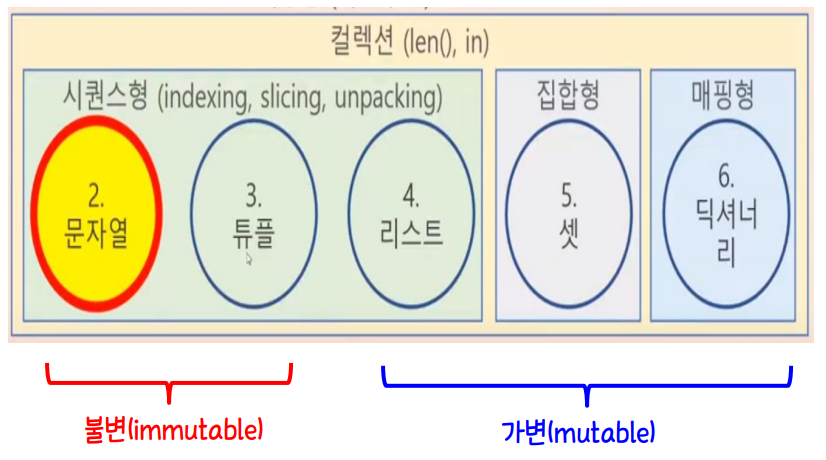
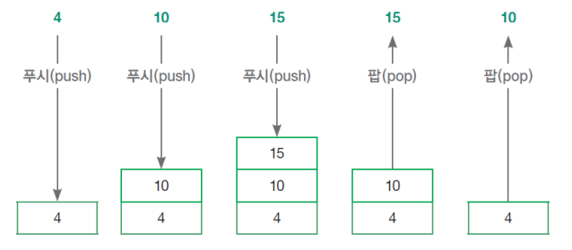

# 자료구조



| 자료 구조명                 | 특징                                                         |
| --------------------------- | ------------------------------------------------------------ |
| **리스트**<br />스택(Stack) | Last In First Out                                            |
| **리스트**<br />큐(Queue)   | First In First Out                                           |
| **튜플**                    | 데이터 변경 허용 X                                           |
| **세트**(Set)               | 데이터 중복 허용 X <br />수학의 집합 연산 지원<br />키값만 모아놓은 딕셔너리의 형태 |
| **딕셔너리**(Dictionary)    | 키(Key) = 값(Value) 형태로 데이터 저장<br />키값은 데이터 중복 허용 X |
| collections 모듈            | 자료구조에 활용되는 Python Built-in 함수                     |

- 공용 연산자
  - *`len()` : 길이*
  - *`in`/`not in` : 요소 여부*


## 시퀸스

> 여러 자료를 순서대로 넣는 것
>
> Indexing , Slicing , Unpacking

- String형 , Tuple형 , List형
- Indexing(인덱싱)

```python
s[0], s[1], s[2], s[-2], ...
```

- Slicing(슬라이스)

```python
s[i:j:z], s[i:j], ...
```

- Unpacking(패킹/언패킹)

- For문으로 개별 문자 순서대로 꺼낼 수도 있음


## 리스트

### 스택 / 큐

> 스택 : Last In First Out
>
> 큐 : First In First Out



- 푸시(Push) : 리스트에 새로운 데이터 삽입
  - `.append()`함수로 삽입
- 팝(Pop) : 최근 들어간 데이터 추출
  - `.pop()` 함수로 추출

```python
스택==============================
a = [1, 2, 3, 4, 5]
#.append(<삽입값>)
a.append(10)

print(a)
[1, 2, 3, 4, 5, 10]

a.pop

print(a)
[1, 2, 3, 4, 5]

큐==================================
#인덱싱(Indexing) 방식
a = [1, 2, 3, 4, 5]
a.append(10)

print(a)
[1, 2, 3, 4, 5, 10]

a.pop(3)

print(a)
[1, 2, 3, 5, 10]

a.pop(0)

print(a)
[2, 3, 5, 10]
```


