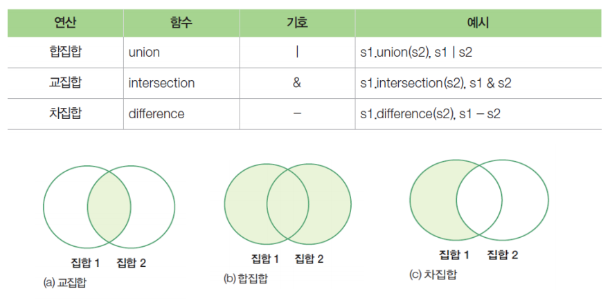

# 세트 (Set)

- 세트 생성
  - 비어있는 셋(Set)은 잘 만들지 않음.
    - Dictionary에서 `{}`로 빈 Dict 만들 수 있기 때문에 *Set에서는 {} 사용 불가*
    - set() 로 빈 세트

```python
a = set()
b = set([1, 2, 3, 3,4])	#리스트로 세트 만들기
c = {1, 4, 5, 6, 1, 4}
d = set([1, 2, 'Pen', 'Cap', 'Plate'])
e = set((10,))	# set((<요소> ,)) = {<요소>,}	튜플로 세트 만들기
f = {100,}		# 하나의 요소로만 생성할 땐 쉼표(,) 

print('a - ', type(a), a)
a -  <class 'set'> set()

print('b - ', type(b), b)
b -  <class 'set'> {1, 2, 3, 4}

print('c - ', type(c), c)
c -  <class 'set'> {1, 4, 5, 6}

print('d - ', type(d), d)
d -  <class 'set'> {1, 2, 'Cap', 'Pen', 'Plate'}

print('e - ', type(e), e)
e -  <class 'set'> {10}

print('f - ', type(f), f)
f -  <class 'set'> {100}

```


- interable 가능하기때문에 데이터 추출 가능
  - 순서 상관없이 **무작위로 추출**되는 데이터 구조
  - 같은 값 **중복**은 **불가**
  - *중복만 안되지*  **컴프리헨션** 가능(Dict Comprehension 구조와 동일)

```python
for data in d :
    print(data)
    
1
2
Cap
Pen
Plate
```


- 추가 / 제거 / 갯수
  - `.aad` : 추가
  - `.update` : 집합끼리 결합(합집합)

```python
s1 = set()	# 빈 세트 생성

s1.add(10);s1.add(20);s1.add(30);s1.add(40);s1.add(50)
print(s1)

{40, 10, 50, 20, 30}		#세트는 무작위 배치

s1.add(10)          # 같은 값 중복 불가 특성
print(s1)

{40, 10, 50, 20, 30}

s1.update([40,50,60,70])            # 이중에 없는 애들만 추가됨
print( s1)

{70, 40, 10, 50, 20, 60, 30}

s1.remove(30)
print(s1)
{70, 40, 10, 50, 20, 60}

```


- **in / not in** 사용 가능

  ```python
  mammal = { '코끼리', '고릴라', '사자', '고래', '사람', '원숭이', '개' }
  primate = { '사람', '원숭이', '고릴라' }
  #in notin 사용 가능
  if '사자' in mammal:
      print("사자는 포유류이다")
  else:
      print("사자는 포유류가 아니다.")
  
  사자는 포유류다
  ```

  - 셋(Set) -  *비교연산자*가 **포함관계** 표현

  ```python
  mammal = { '코끼리', '고릴라', '사자', '고래', '사람', '원숭이', '개' }
  primate = { '사람', '원숭이', '고릴라' }
  
  print(primate <= mammal)	#부분집합
  print(primate < mammal)		#진성 부분집합 _ 부분집합 & 원소가 더 있음
  print(primate <= primate)	
  print(primate < primate)
  
  True
  True
  True
  False
  
  print(mammal.union(primate), mammal | primate)	#primate < mammal 이기때문에  mammal 출력과 동일
  {'사람', '코끼리', '고래', '원숭이', '개', '사자', '고릴라'} {'사람', '코끼리', '고래', '원숭이', '개', '사자', '고릴라'}
  
  print(mammal.intersection(primate), mammal & primate)
  {'원숭이', '사람', '고릴라'} {'원숭이', '사람', '고릴라'}
  
  print(mammal.difference(primate), mammal - primate)
  {'사자', '고래', '개', '코끼리'} {'사자', '고래', '개', '코끼리'}
  
  ```

  

- 데이터 구조 변환

  - 튜플

  ```python
  b = set([1, 2, 3, 3,4])	#리스트로 세트 만들기
  
  
  t = tuple(b)
  print( type(t), t)
  tuple -  <class 'tuple'> (1, 2, 3, 4)
  
  print( t[0], t[1:3])
  tuple -  1 (2, 3)
  ```

  

  - 리스트

  ```python
  c = {1, 4, 5, 6, 1, 4}
  
  l = list(c)
  print( type(l), l)
  <class 'list'> [1, 4, 5, 6]
  
  print( l[0], l[1:3])
  1 [4, 5]
  
  ```

  

- 튜플과 다르게 수정 가능 (가변)

