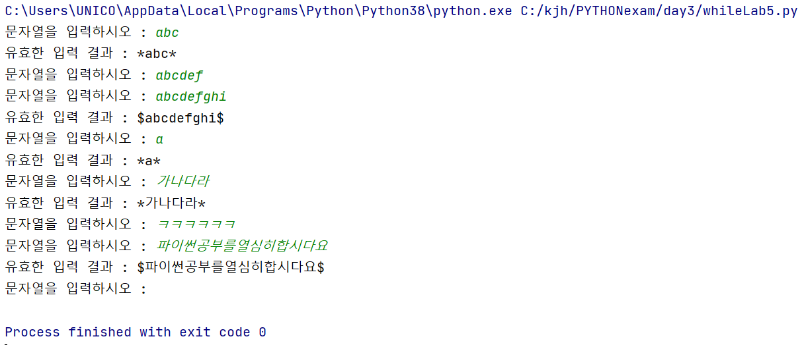

# 반복문_While

> 유사한 명령을 특정 조건에 해당될 때까지 반복 실행하는 제어문

- 루프(Loop) : *특정 변수 값*  기준 반복적으로 처리되는 명령
- 제어 변수 : 반복을 통제하는 변수

- ''바깥'' 순환 구조 → ''안쪽'' 순환 구조 순으로 반복


#반복문은 "코드 변경"이 쉬움 ( 조건식 / 출력문 등 변경)

## While 반복문

> "조건식"이 참일 때 반복하는 방식

- 변수 선언

```python
#구조
(변수 선언)

while <조건> :
    명령
    (제어 변수)
```


```python
student = 1
while student <= 5:
    print(student, "번 학생의 성적을 처리한다.")
    student += 1
print("수행종료")

1 번 학생의 성적을 처리한다.
2 번 학생의 성적을 처리한다.
3 번 학생의 성적을 처리한다.
4 번 학생의 성적을 처리한다.
5 번 학생의 성적을 처리한다.
수행종료

```


- 여러 변수 한 번에 선언 가능
  - <Var1>, <Var2> = <Value 1>, <Value 2>

```python
# 반복 결과가 참이 될 때까지 반복
while True :
    print('Hi', end = '')
    
HiHiHiHiHiHiHi........(무한)
```


```python

import random    
dice_num = 0
count = 0
while dice_num != 3:    # 3이 아닐 때 계속 반복
    dice_num = random.randint(1, 6)    
    print(dice_num)		#3이 아닌 값들이 나온걸 모두 출력
    count += 1
print(count, "회 반복", sep="")

```


```python
#누적합 명령
x = 0
i = 1
while i < 11 :
    x = x + i	# x += i 동일
    i = i + 1	# i += 1 동일
print(i)    

>>> 1 ~ 10까지의 누적합 결과

#짝수 단계적 누적합
a = 0
b = 0
while b <= 100 :
    b += a
    a += 2
    print ('even_sum' = b)	#내부 계산식과 같은 열이기때문에 5050이 될 때까지의 값들 모두 출력
# While 명령과 같은 열에 print 명령 내리면 총 합값만 출력
```


▼ break를 주지 않는다면 무한루프

```python
import random    # random 모듈을 가져옴
dice_num = random.randint(1, 6)
print("추출된 주사위 값 :", dice_num)
while dice_num > 4 :
    print("gg")     #여기서만 끝나면  4보다 큰 5,6이 나오면 "gg" 무한루프
	break			#무한 루프 방지
print("종료!!")
```


```python
#구구단 While문
dan = 1
while dan <= 10 :
    hang = 1
    print(dan, '단')
    while hang <=10 :
        print(dan, '*', hang, '=', dan * hang)
        hang += 1		#dan이 1씩 올라갈 때마다 hang이 10될 때까지의 과정 반복
    dan += 1 			#맨 위로 다시 올라감
    print()
```

### 무한루프

> 반복횟수를 정하지 않고 무한히 반복하는 루프

- For문에서는 만들수 없음(범위_Collection을 지정하기 때문)

```python
#input함수_원하는 값 입력할 때까지 무한반복
print("3 + 4 = ?")
while True:
    a = int(input("정답을 입력하시오 : "))
    if a == 7 :
        break
print("참 잘했어요")

#Continue / Break 활용
while True:     # 문자열의 경우 '비어있는 경우'가 False
    a = input("정답을 입력하시오 : ")
    if a == "" :                    #공백은 문자열 → int()를 제외해야함
        print("입력된 값이 없어요.")
        print("확인 바랍니다.")
        print("\n")
        continue
    if int(a) != 7 :		#int(input()) 이 아니기때문에
        print("땡!")
        continue
    if int(a) == 7 :
        break
print("참 잘했어요")

##elif를 사용하면 종속관계이기때문에 continue 사용 안해도 됨.
```


```python

import random    
count = 0
while True:
    count += 1
    num = random.randint(1, 20)
    if num % 5 == 0 :
        print("End")
        break
    elif num % 2 == 0 :					#5의 배수 아니여서 elif로 넘어옴
        print("Again")
        continue                        #다시 count += 1 로 올라가서 반복 진행
    else :						#5와 2의 배수가 아닌 수 일때
        for i in range(num) :
            print('*', end="")	#나온 숫자만큼 * 출력
        print()
    print("지금까지", count, "회 반복")    #출력은 하되 break나 continue가 없어서 다시 while문으로 올라가서 반복
print("====== 수행 종료 =====")			
```


## 실습

```
[ 실습1 ]
1. whileLab1.py 라는 소스를 생성한다.
2. 5부터 10사이의 난수를 추출한다.
3. 1부터 추출된 숫자값까지의 각 숫자들의 제곱값을 행단위로 출력한다.
   ===>  7이 추출되면
 		1 -> 1
     	2 -> 4
     	3 -> 9
     	4 -> 16
     	5 -> 25
     	6 -> 36
     	7 -> 49
```


```
[ 실습2 ]
1. whileLab2.py 라는 소스를 생성한다.
2. 다음 기능을 반복해서 수행하는 프로그램을 구현하며 반복문으로 while 문을 사용한다.
3. 반복 처리해야 하는 기능은 다음과 같다.

    1부터 6사이의 두 개 난수를 추출하여 각각 pairNum1, pairNum2 에 저장한다.
    
    추출된 두 개의 숫자가 서로 다르면 값의 크기를 비교하여 
    "pairNum1이 pairNum2 보다 크다." 또는 "pairNum1이 pairNum2 보다 작다." 
    출력한다.
    
    추출된 두 개의 숫자가 동일하면 "게임 끝"이라는 메시지를 출력하고 종료한다.

```

```
[ 실습3 ] - while 문으로 무한루프 처리
1. whileLab3.py 라는 소스를 생성한다.
2. 0부터 30사이의 난수를 추출한다.
    추출된 숫자가 1이면 'A', 2 이면 'B', ... 26이면 'Z' 를 출력하는데
    계속 난수 추출과 출력을 반복하다가 난수가 0이 추출되거나
    27~30이 추출되면 반복을 끝낸다.

    반복하는 동안 출력형식 :  	
			B(2)
    		A(1)
			D(4)
			  :
    마지막에는 "수행횟수는 x 번입니다"를 출력하고 종료한다. 
    수행 횟수는 출력을 기준으로 계산한다.
```


```
[ 실습4 ] - while 문으로 무한루프 처리
1. whileLab4py 라는 소스를 생성한다.
2. 반복 처리해야 하는 기능은 다음과 같다.
	사용자로부터 월에 해당하는 숫자를 하나 입력 받는다.
	
	입력된 숫자가 1~12 사이의 값이면
    12, 1, 2의 경우엔 x월은 겨울
	3, 4, 5의 경우엔 x월은 봄
	6, 7, 8의 경우엔 x월은 여름
	9, 10, 11의 경우엔 x월은 가을
       을 출력한다.
       
    입력된 숫자가 1~12 사이가 아니면 1~12 사이의 값을 입력하세요! 를 출력하고 종료한다.
```


```
[ 실습5 ] - while 문으로 무한루프 처리
1. whileLab5py 라는 소스를 생성한다.
2. 반복 처리해야 하는 기능은 다음과 같다.
	- 사용자로부터 문자열을 하나 입력받아 word 라는 변수에 저장한다.
	- word 변수에 저장된 데이터의 길이를 추출하여(문자열 길이는 len() 이라는 함수를 사용한다.) 
	  wordlength 라는 변수에 저장한다.
    
    - wordlength 라는 변수에 할당된 값에 따라서 다음 기능을 수행한다.
         - 값이 0 이면 반복을 종료한다.
         - 값이 5 이상이고 8 이하이면 아무 기능도 수행하지 않고 
         						입력받는 기능부터 다시 수행한다.
         - 값이 5 미만이면 문자열의 앞과 뒤에 “*” 기호를 붙여서 result 변수에 저장한다.
         - 값이 8 초과이면 문자열의 앞과 뒤에 “$” 기호를 붙여서 result 변수에 저장한다.
         
    - result 변수의 값을 다음 형식으로 출력한다. 
		"유효한 입력 결과 : ........"
       
3. 다음은 이 프로그램의 수행 결과이다.
```

    


```
[ 실습6 ] - while 문으로 무한루프 처리
1. whileLab6py 라는 소스를 생성한다.
2. 반복 처리해야 하는 기능은 다음과 같다.
- 숫자를 하나 입력받는다.

- 입력 숫자가 0 이면 “종료”라는 메시지를 출력하고 수행을 종료한다.
- 입력된 숫자가 -10 보다 작거나 10보다 크면 입력 받는 것부터 다시 시작한다.
- 입력된 숫자가 양수이면 “입력값 : x” 행을 출력한 다음 행에 1부터 입력된 숫자 값까지의 곱한 
  결과를 출력한다.
- 입력된 숫자가 음수이면 양수로 변경하여 “입력값(부호변경) : x” 를 출력한 다음 행에 1부터 입력된 
  숫자 값까지의 곱한 결과를 출력한다.

5 가 입력되면 
	
	입력값 : 5 
	120

-3 이 입력되면
	
	입력값(부호변경) : 3
       6

0 이 입력되면
	
	종료
```


### 풀이

```python
#[실습1]
import random
num = random.randint(5,10)
a = 1

while a <= num :
    print(a, " -> ", a**2)
    a= a+1
```


```python
#[실습2]
import random

while True :
    pairNum1 = random.randint(1, 6)
    pairNum2 = random.randint(1, 6)
#확인차원 print("pairNum1 : ", pairNum1, "pairNum2 : ", pairNum2) 해보기
    if pairNum1 > pairNum2 :
        print("pairNum1이 pairNum2 보다 크다")
        continue
    if pairNum1 < pairNum2 :
        print("pairNum1이 pairNum2 보다 작다")
        continue
    if pairNum1 == pairNum2:
        print("게임 끝")
        break
```


```python
#[실습3]
import random
count = 0

while True :
    num = random.randint(0,30)
    if num >= 1 and num <=26 :	# 1 <= num <= 26
        print(chr(num+64), "(", num, ")", sep="")   #sep="" 으로 여백 없애기
        count += 1      # while True로 다시 돌아감
    elif num == 0 or num > 26 :
        print("수행횟수는", count, "번입니다")
        break
```


```python
#[실습4]
while True :
    month = int(input("이 달의 계절 : "))
    if  month < 1 or month >12 :
        print("1~12 사이의 값을 입력하세요!")
        break
    elif month == 12 or month < 3 :
        print(month, "월은 겨울")
    elif 3 <= month <= 5 :
        print(month, "월은 봄")
    elif 6 <= month <= 8 :
        print(month, "월은 여름")
    else :
        print(month, "월은 가을")
        
   #elif month < 1 or month >12 :
   #     print("1~12 사이의 값을 입력하세요!")
   #     break
```


```python
#[실습5]
while True :
    word = input("문자열을 입력하시오. : ")
    wordlength = len(word)				#문자열 길이
    if wordlength == 0 :
        break
    elif 5<= wordlength <=8 :
        continue        #pass 써도됨
    elif wordlength <5 :
        result = '*' + word + '*'
        print('유효한 입력 결과 :', result)
    else :
        result = '$' + word + '$'
        print('유효한 입력 결과 :', result)
```


```python
#[실습6]
while True :
    num = int(input("숫자를 입력하시오 : "))
    if num == 0 :
        print('종료')
        break
    elif num < -10 or num >10 :
        continue
    elif num >0 :
        end_num = 2		# *1은 해봤자 그대로이기때문에 2부터 시작
        output = 1
        print('입력값 : ', num)
        while end_num <= num :
            output = output * end_num    # output *= end_num 동일 / 다음 output은 누적 곱값이 되야함.
            end_num += 1		#while end_num <= num으로 올라감
        print(output)			#'입력값 : num' 밑줄에 출력이기때문에 while문 블럭에 맞춰서
        #continue    생략해도됨
    elif num < 0 :
        num = abs(num) # <num = -num> 이나 <num * -1> 가능
        print('입력값(부호변경) : ', num)
        end_num = 2
        output = 1
        while end_num <= num :
            output = output * end_num
            end_num += 1
        print(output)
```

